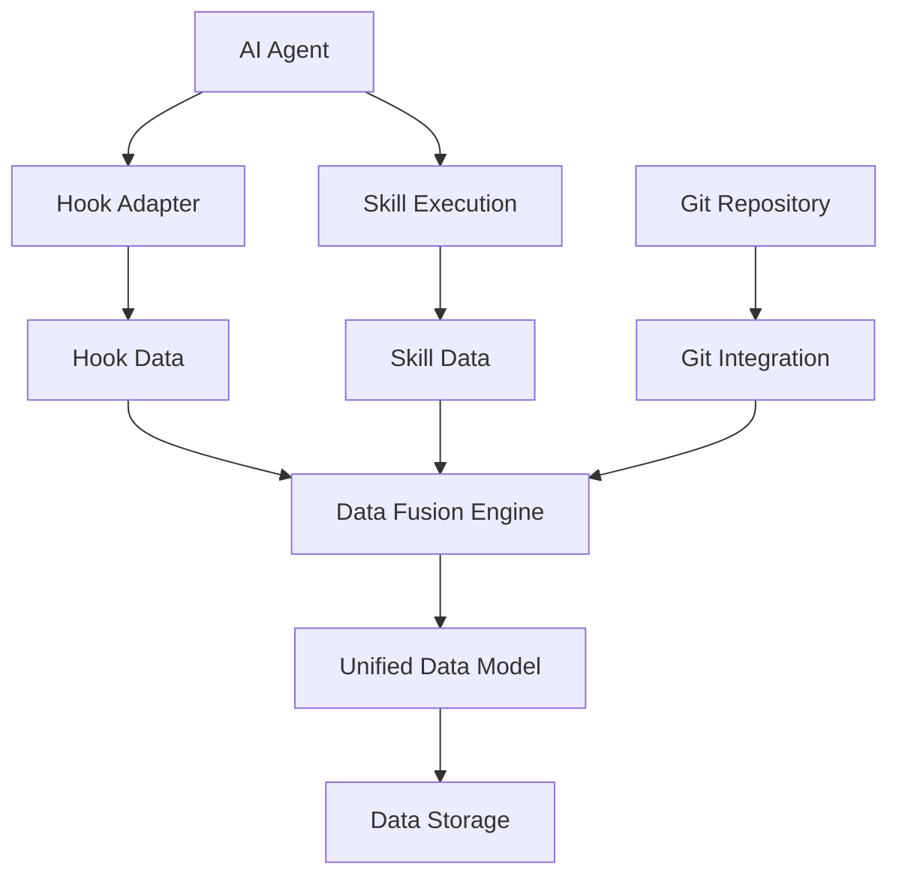
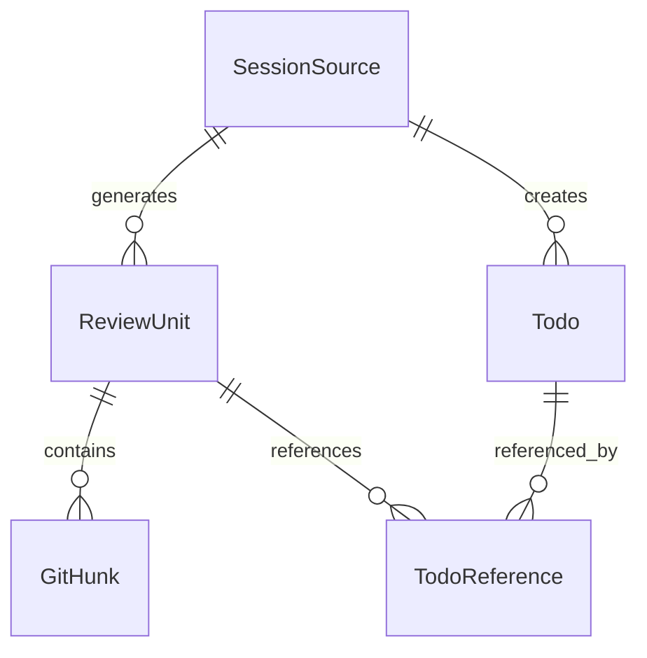
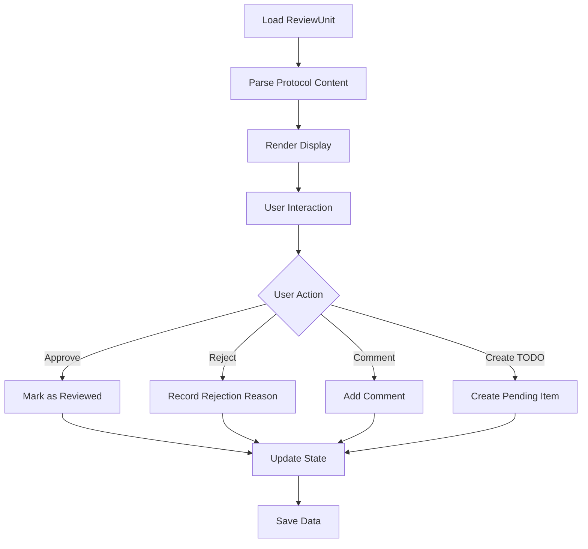

# Architecture Design

**Document Version**: v1.0  
**Created Date**: 2026-01-04  
**Last Updated**: 2026-01-04

---

## 1. Overall System Architecture

### 1.1 Architecture Overview

Vibe Review adopts **4-layer architecture design**, forming a complete technology stack from bottom-level tools to top-level products:

```
┌─────────────────────────────────────────────────────────────┐
│  Layer 4: Product Delivery                                    │
│  ├─ GitLens Integration | Standalone Panel | IDE Plugin | CLI    │
├─────────────────────────────────────────────────────────────┤
│  Layer 3: Product Core                                       │
│  ├─ Protocol Parser | Rendering Engine | Interaction Logic | State Mgmt │
├─────────────────────────────────────────────────────────────┤
│  Layer 2: Data Layer                                        │
│  ├─ SessionSource | ReviewUnit | Todo                        │
├─────────────────────────────────────────────────────────────┤
│  Layer 1: Tool Layer                                        │
│  ├─ Hook + Skill Dual-Track | Git Integration | Post-processing│
└─────────────────────────────────────────────────────────────┘
```

### 1.2 Architecture Principles

1. **Layered Decoupling**: Clear responsibilities per layer, upper layers depend on lower layers, lower layers do not depend on upper layers
2. **Data-Driven**: Data model at the core, all layers designed around data
3. **Open Standards**: Adopt open protocols, support ecosystem extension
4. **Progressive**: Support progressive development and deployment of features

---

## 2. Layer 1: Tool Layer

### 2.1 Layer Responsibilities
Responsible for data collection, processing, and storage, providing unified data interface for upper layers.

### 2.2 Core Components

#### 2.2.1 Hook + Skill Dual-Track System

**Hook Track**:
```typescript
interface HookCore {
  // Unified Hook interface
  onSessionStart(sessionId: string): void;
  onCodeChange(change: CodeChange): void;
  onSessionEnd(sessionId: string): void;
}

interface AgentAdapter {
  // Agent-specific adapters
  adaptCursor(): HookCore;
  adaptClaude(): HookCore;
  adaptDuet(): HookCore;
}
```

**Skill Track**:
```yaml
# vibe-review-core.skill.yaml
name: vibe-review-core
description: Generate Agent Review Protocol content
version: "0.3.0"
required: true
trigger: "on_code_completion"
```

#### 2.2.2 Data Fusion Engine

```typescript
interface DataFusion {
  merge(hookData: HookData, skillData: SkillData): ReviewData;
  resolveConflicts(conflicts: DataConflict[]): Resolution[];
  validate(data: ReviewData): ValidationResult;
}
```

**Conflict Handling Strategy**:
- Engineering metrics (timestamps, file paths, Git hash) follow Hook
- Protocol content (Intent, Rationale) follow Skill
- Other conflicts recorded first, manual handling later

#### 2.2.3 Git Integration

```typescript
interface GitIntegration {
  getDiff(commitHash?: string): GitDiff[];
  getFileHistory(filePath: string): FileHistory[];
  getBranchInfo(): BranchInfo;
}
```

**Technology Selection**: simple-git
- Provides structured Git data
- Good cross-platform compatibility
- Simple and easy-to-use API

### 2.3 Data Flow Design



---

## 3. Layer 2: Data Layer

### 3.1 Layer Responsibilities
Define unified data models, manage data storage and queries.

### 3.2 Core Data Models

#### 3.2.1 SessionSource

```typescript
interface SessionSource {
  agent: 'cursor' | 'claude' | 'duet' | string;
  sessionId: string;
  qaIndex: number;  // Which round of QA conversation
  timestamp: number;
  metadata?: {
    userPrompt?: string;
    agentResponse?: string;
    context?: any;
  };
}
```

#### 3.2.2 ReviewUnit

```typescript
interface ReviewUnit {
  id: string;
  sessionSource: SessionSource;
  hunks: GitHunk[];  // May contain multiple code blocks
  annotation: {
    // Agent Review Protocol v0.3 fields
    intent: string;
    changes: string[];
    rationale: string;
    tests: string[];
    edgeCases: string[];
    // Optional fields
    impact?: string;
    alternatives?: string[];
    assumptions?: string[];
    confidence?: number;
  };
  todos: TodoReference[];
  createdAt: number;
  updatedAt: number;
}
```

#### 3.2.3 Todo

```typescript
interface Todo {
  id: string;
  content: string;
  status: 'pending' | 'in_progress' | 'completed';
  priority: 'low' | 'medium' | 'high';
  sessionSource: SessionSource;  // Source tracing
  reviewUnits: string[];  // Associated ReviewUnit IDs
  createdAt: number;
  updatedAt: number;
  dueDate?: number;
  assignee?: string;
}
```

### 3.3 Storage Design

#### 3.3.1 Storage Structure
```
.vibe-review/
├── data/
│   ├── sessions/
│   │   ├── 2026-01-04/
│   │   │   ├── session-001.json
│   │   │   └── session-002.json
│   │   └── index.json
│   ├── review-units/
│   │   ├── unit-001.json
│   │   └── unit-002.json
│   ├── todos.json
│   └── metadata.json
└── config/
    ├── settings.json
    └── adapters.json
```

#### 3.3.2 Data Relationships



---

## 4. Layer 3: Product Core Layer

### 4.1 Layer Responsibilities
Provide core logic of product features, including protocol parsing, content rendering, interaction handling, etc.

### 4.2 Core Components

#### 4.2.1 Protocol Parser

```typescript
interface ProtocolParser {
  parse(rawContent: string): AgentProtocol;
  validate(protocol: AgentProtocol): ValidationResult;
  normalize(protocol: AgentProtocol): NormalizedProtocol;
}

interface AgentProtocol {
  what: {
    intent: string;
    changes: string[];
  };
  why: {
    rationale: string;
  };
  howToVerify: {
    tests: string[];
    edgeCases: string[];
  };
  impact?: {
    affectedAreas: string[];
    risks: string[];
  };
}
```

#### 4.2.2 Rendering Engine

```typescript
interface RenderEngine {
  renderReviewUnit(unit: ReviewUnit): RenderedContent;
  renderTodoList(todos: Todo[]): RenderedContent;
  renderDiff(hunks: GitHunk[], annotation: Annotation): RenderedContent;
}

interface RenderedContent {
  html?: string;
  markdown?: string;
  terminal?: string;
  metadata: RenderMetadata;
}
```

#### 4.2.3 Interaction Logic

```typescript
interface InteractionHandler {
  handleReviewAction(action: ReviewAction): Promise<ActionResult>;
  handleTodoAction(action: TodoAction): Promise<ActionResult>;
  handleNavigationAction(action: NavigationAction): Promise<ActionResult>;
}

type ReviewAction = 
  | { type: 'approve'; unitId: string }
  | { type: 'reject'; unitId: string; reason: string }
  | { type: 'comment'; unitId: string; comment: string };

type TodoAction =
  | { type: 'create'; content: string; unitId: string }
  | { type: 'update'; todoId: string; updates: Partial<Todo> }
  | { type: 'complete'; todoId: string };
```

#### 4.2.4 State Management

```typescript
interface StateManager {
  getCurrentSession(): SessionState;
  getReviewProgress(): ReviewProgress;
  updateState(updates: StateUpdate): void;
  subscribeToChanges(callback: StateChangeCallback): Unsubscribe;
}

interface SessionState {
  currentReviewUnits: ReviewUnit[];
  activeTodos: Todo[];
  reviewProgress: ReviewProgress;
  userPreferences: UserPreferences;
}
```

### 4.3 Core Processes

#### 4.3.1 Review Workflow



---

## 5. Layer 4: Product Delivery Layer

### 5.1 Layer Responsibilities
Provide product forms that users directly use, including various clients and integration methods.

### 5.2 Product Forms

#### 5.2.1 CLI Tool

```bash
# Basic commands
vibe-review diff --annotated
vibe-review review --format=markdown
vibe-review todos --interactive

# Advanced commands
vibe-review analyze --session=latest
vibe-review export --format=json --output=report.json
vibe-review config --set agent=cursor
```

**Features**:
- Zero-configuration startup
- Rich command-line options
- Support for pipeline operations

#### 5.2.2 VS Code Plugin

```typescript
interface VSCodeExtension {
  activateReviewPanel(): void;
  showInlineAnnotations(document: TextDocument): void;
  highlightReviewUnits(units: ReviewUnit[]): void;
  provideTodoHover(position: Position): Hover;
}
```

**Functions**:
- Sidebar Review panel
- Inline code annotations
- TODO hover hints
- Keyboard shortcut support

#### 5.2.3 GitLens Integration

```typescript
interface GitLensIntegration {
  enhanceCodeLens(codeLens: CodeLens[]): CodeLens[];
  provideHoverInfo(uri: Uri, position: Position): ProviderResult<Hover>;
  decorateGutterIcons(editor: TextEditor): void;
}
```

**Functions**:
- Display protocol content next to Git blame
- Enhanced hover information
- Custom decorators

#### 5.2.4 Standalone Panel

```typescript
interface StandalonePanel {
  renderReviewDashboard(): ReactElement;
  renderTodoManager(): ReactElement;
  renderSessionHistory(): ReactElement;
  renderSettings(): ReactElement;
}
```

**Technology Stack**:
- React + TypeScript
- Electron (desktop application)
- Web version (browser)

---

## 6. Core Mechanism Design

### 6.1 Agent Review Protocol v0.3

#### 6.1.1 Protocol Structure

```markdown
## WHAT
**Intent**: [One-sentence intent description]
**Changes**: 
- [File 1]: [Change description]
- [File 2]: [Change description]

## WHY
**Rationale**: [Design rationale and decision basis]

## HOW TO VERIFY
**Tests**:
1. [Test step 1]
2. [Test step 2]

**Edge Cases**:
- [Edge case 1]
- [Edge case 2]

## IMPACT
**Affected Areas**: [Other modules or systems affected]
**Risks**: [Potential risks]
```

#### 6.1.2 Generation Rules

```typescript
interface ProtocolGenerator {
  generateIntent(userPrompt: string, codeChanges: CodeChange[]): string;
  generateChanges(gitDiff: GitDiff[]): string[];
  generateRationale(context: GenerationContext): string;
  generateTests(intent: string, changes: string[]): string[];
  generateEdgeCases(codeChanges: CodeChange[]): string[];
  generateImpact(changes: string[], codebase: CodebaseInfo): string;
}
```

### 6.2 Hook + Skill Dual-Track System

#### 6.2.1 Hook Mechanism

```typescript
// Hook Core interface
interface HookCore {
  registerAdapter(agent: string, adapter: AgentAdapter): void;
  startSession(sessionId: string): void;
  captureEvent(event: AgentEvent): void;
  endSession(sessionId: string): HookData;
}

// Agent adapter
interface AgentAdapter {
  name: string;
  version: string;
  hooks: {
    onSessionStart?: (sessionId: string) => void;
    onCodeChange?: (change: CodeChange) => void;
    onUserPrompt?: (prompt: string) => void;
    onAgentResponse?: (response: string) => void;
    onSessionEnd?: (sessionId: string) => void;
  };
}
```

#### 6.2.2 Skill Mechanism

```yaml
# Skill definition format (following Agent Skills protocol)
name: vibe-review-core
description: "Generate Agent Review Protocol content"
version: "0.3.0"
category: "code-review"
required: true
dependencies: []
```

```markdown
# vibe-review-core Skill content

## Function Description
After code generation is complete, automatically generate structured protocol content that complies with Agent Review Protocol v0.3.

## Usage Method
When you complete code modifications, please call this Skill to generate protocol content:

1. Analyze user requirements and code changes
2. Generate protocol content following 4-layer structure
3. Ensure information completeness and accuracy

## Output Format
Please output strictly following the format below...
```

### 6.3 Data Fusion Mechanism

#### 6.3.1 Fusion Strategy

```typescript
interface FusionStrategy {
  // Timestamp fusion: follow Hook
  mergeTimestamp(hookTime: number, skillTime: number): number;
  
  // File path fusion: follow Hook
  mergeFilePaths(hookPaths: string[], skillPaths: string[]): string[];
  
  // Protocol content fusion: follow Skill
  mergeProtocolContent(hookContent: any, skillContent: AgentProtocol): AgentProtocol;
  
  // Conflict detection
  detectConflicts(hookData: HookData, skillData: SkillData): DataConflict[];
}
```

#### 6.3.2 Conflict Resolution

```typescript
interface ConflictResolver {
  resolveTimestampConflict(conflict: TimestampConflict): Resolution;
  resolveContentConflict(conflict: ContentConflict): Resolution;
  logUnresolvedConflict(conflict: DataConflict): void;
}

type Resolution = 
  | { action: 'use_hook_data' }
  | { action: 'use_skill_data' }
  | { action: 'merge_data'; strategy: MergeStrategy }
  | { action: 'manual_review'; reason: string };
```

---

## 7. Technology Selection

### 7.1 Core Technology Stack

| Component | Technology Selection | Version | Reason |
|-----------|-------------------|---------|--------|
| Runtime | Node.js | 18+ | Cross-platform, rich ecosystem |
| Language | TypeScript | 5.0+ | Type safety, development efficiency |
| Git Integration | simple-git | 3.x | Structured API, stable and reliable |
| Storage | JSON Files | - | Simple, easy to debug, version control friendly |
| CLI Framework | Commander.js | 9.x | Feature complete, active community |

### 7.2 Frontend Technology Stack (Product Delivery Layer)

| Component | Technology Selection | Version | Reason |
|-----------|-------------------|---------|--------|
| UI Framework | React | 18+ | Mature ecosystem, rich components |
| State Management | Zustand | 4.x | Lightweight, easy to use |
| Styling | Tailwind CSS | 3.x | Fast development, good consistency |
| Build Tool | Vite | 4.x | Fast, modern |
| Desktop Application | Electron | 25+ | Cross-platform desktop application |

### 7.3 Development Tools

| Tool | Selection | Reason |
|------|-----------|--------|
| Package Manager | pnpm | Fast speed, high disk efficiency |
| Code Formatting | Prettier | Unified code style |
| Code Linting | ESLint | Code quality assurance |
| Testing Framework | Vitest | Fast, good integration with Vite |
| Documentation Generation | TypeDoc | TypeScript native support |

---

## 8. Performance Design

### 8.1 Performance Targets

| Metric | Target | Description |
|--------|---------|-------------|
| Protocol Generation Time | < 5s | From code completion to protocol generation |
| Data Loading Time | < 2s | Loading ReviewUnit data |
| UI Response Time | < 500ms | User operation response |
| Memory Usage | < 200MB | Resident memory usage |
| Storage Space | < 10MB/1000 sessions | Data storage efficiency |

### 8.2 Performance Optimization Strategies

#### 8.2.1 Data Layer Optimization
- **Lazy Loading**: Load ReviewUnit data on demand
- **Index Optimization**: Build indexes for common queries
- **Data Compression**: Compress stored JSON data
- **Caching Strategy**: Cache hot data in memory

#### 8.2.2 Rendering Optimization
- **Virtual Scrolling**: List rendering for large amounts of data
- **Component Caching**: Cache rendering results
- **Incremental Updates**: Only update changed parts
- **Asynchronous Rendering**: Non-blocking rendering process

#### 8.2.3 Network Optimization
- **Batch Operations**: Merge multiple small operations
- **Request Deduplication**: Avoid duplicate requests
- **Timeout Control**: Reasonable timeout settings
- **Error Retry**: Smart retry mechanism

---

## 9. Security Design

### 9.1 Data Security

#### 9.1.1 Local Storage
- All data stored locally, not uploaded to cloud
- Sensitive information (like API Key) encrypted for storage
- Support data backup and recovery

#### 9.1.2 Access Control
- Project-based access control
- User role and permission management
- Operation audit logs

### 9.2 Code Security

#### 9.2.1 Input Validation
- Strict input parameter validation
- Prevent code injection attacks
- File path security checks

#### 9.2.2 Dependency Security
- Regularly update dependency packages
- Security vulnerability scanning
- Principle of least privilege

---

## 10. Extensibility Design

### 10.1 Agent Extension

```typescript
interface AgentExtension {
  name: string;
  version: string;
  adapter: AgentAdapter;
  skills: SkillDefinition[];
  config: AgentConfig;
}

// Register new Agent support
function registerAgent(extension: AgentExtension): void {
  AgentRegistry.register(extension);
}
```

### 10.2 Protocol Extension

```typescript
interface ProtocolExtension {
  name: string;
  version: string;
  fields: FieldDefinition[];
  validator: ProtocolValidator;
  renderer: ProtocolRenderer;
}

// Extend protocol fields
function extendProtocol(extension: ProtocolExtension): void {
  ProtocolRegistry.extend(extension);
}
```

### 10.3 Plugin System

```typescript
interface Plugin {
  name: string;
  version: string;
  hooks: PluginHooks;
  commands?: Command[];
  ui?: UIComponent[];
}

interface PluginHooks {
  onSessionStart?: (session: SessionSource) => void;
  onReviewUnitCreated?: (unit: ReviewUnit) => void;
  onTodoCreated?: (todo: Todo) => void;
  onDataExport?: (data: ExportData) => void;
}
```

---

*This document describes in detail the system architecture design of Vibe Review, providing technical guidance for subsequent implementation.*
