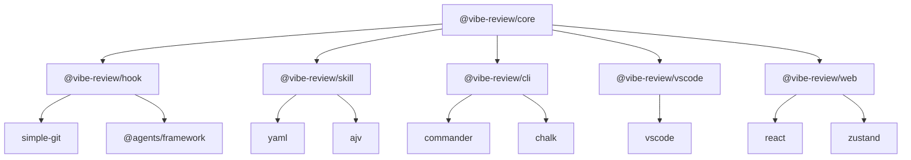

# Technical Implementation Manual

**Document Version**: v1.0  
**Created Date**: 2026-01-04  
**Last Updated**: 2026-01-04

---

## 1. Project Structure

### 1.1 Directory Structure

```
vibe-review/
├── packages/                          # Monorepo package management
│   ├── core/                         # Core library
│   │   ├── src/
│   │   │   ├── types/               # TypeScript type definitions
│   │   │   ├── models/              # Data models
│   │   │   ├── protocols/           # Protocol parsers
│   │   │   ├── storage/             # Data storage
│   │   │   └── utils/               # Utility functions
│   │   ├── tests/                   # Unit tests
│   │   └── package.json
│   ├── hook/                        # Hook system
│   │   ├── src/
│   │   │   ├── core/               # Hook core
│   │   │   ├── adapters/           # Agent adapters
│   │   │   └── events/             # Event handling
│   │   └── package.json
│   ├── skill/                       # Skill system
│   │   ├── templates/              # Skill templates
│   │   ├── validators/             # Validators
│   │   └── package.json
│   ├── cli/                         # Command line tool
│   │   ├── src/
│   │   │   ├── commands/           # CLI commands
│   │   │   ├── renderers/          # Output renderers
│   │   │   └── config/             # Configuration management
│   │   └── package.json
│   ├── vscode/                      # VS Code plugin
│   │   ├── src/
│   │   │   ├── extension.ts        # Plugin entry point
│   │   │   ├── panels/             # Panel components
│   │   │   └── providers/          # Data providers
│   │   └── package.json
│   └── web/                         # Web interface
│       ├── src/
│       │   ├── components/         # React components
│       │   ├── pages/              # Pages
│       │   ├── hooks/              # React Hooks
│       │   └── stores/             # State management
│       └── package.json
├── skills/                          # Skill definitions
│   ├── vibe-review-core/
│   │   ├── SKILL.md                # Core Skill
│   │   └── examples/
│   ├── vibe-review-impact/
│   │   └── SKILL.md                # Impact analysis Skill
│   └── vibe-review-alternatives/
│       └── SKILL.md                # Alternatives Skill
├── docs/                           # Technical documentation
├── examples/                       # Example projects
├── scripts/                        # Build scripts
├── .vibe-review/                   # Local data directory
│   ├── data/
│   └── config/
├── pnpm-workspace.yaml             # Workspace configuration
├── package.json                    # Root package configuration
├── tsconfig.json                   # TypeScript configuration
└── README.md                       # Project description
```

### 1.2 Package Dependencies



---

## 2. Core Module Implementation

### 2.1 Data Model (@vibe-review/core)

#### 2.1.1 Type Definitions

```typescript
// packages/core/src/types/index.ts

export interface SessionSource {
  agent: 'cursor' | 'claude' | 'duet' | string;
  sessionId: string;
  qaIndex: number;
  timestamp: number;
  metadata?: {
    userPrompt?: string;
    agentResponse?: string;
    context?: any;
  };
}

export interface GitHunk {
  filePath: string;
  oldStart: number;
  oldLines: number;
  newStart: number;
  newLines: number;
  content: string;
  type: 'added' | 'deleted' | 'modified';
}

export interface AgentProtocol {
  what: {
    intent: string;
    changes: string[];
  };
  why: {
    rationale: string;
  };
  howToVerify: {
    tests: string[];
    edgeCases: string[];
  };
  impact?: {
    affectedAreas: string[];
    risks: string[];
  };
}

export interface ReviewUnit {
  id: string;
  sessionSource: SessionSource;
  hunks: GitHunk[];
  annotation: AgentProtocol;
  todos: TodoReference[];
  createdAt: number;
  updatedAt: number;
}

export interface Todo {
  id: string;
  content: string;
  status: 'pending' | 'in_progress' | 'completed';
  priority: 'low' | 'medium' | 'high';
  sessionSource: SessionSource;
  reviewUnits: string[];
  createdAt: number;
  updatedAt: number;
  dueDate?: number;
  assignee?: string;
}

export interface TodoReference {
  todoId: string;
  context: string;
  lineNumber?: number;
}
```

#### 2.1.2 Data Storage

```typescript
// packages/core/src/storage/FileStorage.ts

export class FileStorage {
  private dataDir: string;

  constructor(projectRoot: string) {
    this.dataDir = path.join(projectRoot, '.vibe-review', 'data');
    this.ensureDirectories();
  }

  async saveReviewUnit(unit: ReviewUnit): Promise<void> {
    const filePath = path.join(this.dataDir, 'review-units', `${unit.id}.json`);
    await fs.writeFile(filePath, JSON.stringify(unit, null, 2));
  }

  async loadReviewUnit(id: string): Promise<ReviewUnit | null> {
    const filePath = path.join(this.dataDir, 'review-units', `${id}.json`);
    try {
      const content = await fs.readFile(filePath, 'utf-8');
      return JSON.parse(content) as ReviewUnit;
    } catch (error) {
      return null;
    }
  }

  async saveTodos(todos: Todo[]): Promise<void> {
    const filePath = path.join(this.dataDir, 'todos.json');
    await fs.writeFile(filePath, JSON.stringify(todos, null, 2));
  }

  async loadTodos(): Promise<Todo[]> {
    const filePath = path.join(this.dataDir, 'todos.json');
    try {
      const content = await fs.readFile(filePath, 'utf-8');
      return JSON.parse(content) as Todo[];
    } catch (error) {
      return [];
    }
  }

  private async ensureDirectories(): Promise<void> {
    await fs.mkdir(path.join(this.dataDir, 'sessions'), { recursive: true });
    await fs.mkdir(path.join(this.dataDir, 'review-units'), { recursive: true });
    await fs.mkdir(path.join(this.dataDir, 'config'), { recursive: true });
  }
}
```

### 2.2 Hook System (@vibe-review/hook)

#### 2.2.1 Hook Core

```typescript
// packages/hook/src/core/HookCore.ts

export class HookCore {
  private adapters = new Map<string, AgentAdapter>();
  private activeSession: string | null = null;
  private events: AgentEvent[] = [];

  registerAdapter(agent: string, adapter: AgentAdapter): void {
    this.adapters.set(agent, adapter);
    adapter.initialize(this);
  }

  startSession(sessionId: string, agent: string): void {
    this.activeSession = sessionId;
    this.events = [];
    
    const adapter = this.adapters.get(agent);
    if (adapter) {
      adapter.onSessionStart?.(sessionId);
    }
  }

  captureEvent(event: AgentEvent): void {
    if (!this.activeSession) return;
    
    this.events.push({
      ...event,
      sessionId: this.activeSession,
      timestamp: Date.now()
    });
  }

  endSession(): HookData | null {
    if (!this.activeSession) return null;

    const sessionId = this.activeSession;
    const events = [...this.events];
    
    this.activeSession = null;
    this.events = [];

    return {
      sessionId,
      events,
      summary: this.generateSummary(events)
    };
  }

  private generateSummary(events: AgentEvent[]): SessionSummary {
    const codeChanges = events.filter(e => e.type === 'code_change');
    const userPrompts = events.filter(e => e.type === 'user_prompt');
    
    return {
      totalEvents: events.length,
      codeChanges: codeChanges.length,
      userPrompts: userPrompts.length,
      duration: events.length > 0 ? 
        events[events.length - 1].timestamp - events[0].timestamp : 0
    };
  }
}
```

#### 2.2.2 Cursor Adapter

```typescript
// packages/hook/src/adapters/CursorAdapter.ts

export class CursorAdapter implements AgentAdapter {
  name = 'cursor';
  version = '1.0.0';
  private hookCore: HookCore | null = null;

  initialize(hookCore: HookCore): void {
    this.hookCore = hookCore;
    this.setupCursorHooks();
  }

  onSessionStart(sessionId: string): void {
    console.log(`Cursor session started: ${sessionId}`);
  }

  private setupCursorHooks(): void {
    // Setup hooks through AGENTS framework API
    if (typeof window !== 'undefined' && (window as any).agents) {
      const agents = (window as any).agents;
      
      agents.onCodeChange((change: any) => {
        this.hookCore?.captureEvent({
          type: 'code_change',
          data: {
            filePath: change.filePath,
            content: change.content,
            operation: change.operation
          }
        });
      });

      agents.onUserPrompt((prompt: any) => {
        this.hookCore?.captureEvent({
          type: 'user_prompt',
          data: {
            content: prompt.content,
            context: prompt.context
          }
        });
      });
    }
  }
}
```

### 2.3 Skill System (@vibe-review/skill)

#### 2.3.1 Core Skill Template

```markdown
<!-- skills/vibe-review-core/SKILL.md -->

---
name: vibe-review-core
description: "Generate Agent Review Protocol v0.3 protocol content"
version: "0.3.0"
category: "code-review"
required: true
dependencies: []
---

# Vibe Review Core Skill

## Function Description

After code generation is complete, automatically generate structured protocol content that complies with Agent Review Protocol v0.3, helping establish understanding and trust in code during Code Review process.

## When to Use

Please call this Skill when you complete the following tasks:
- Implementing new features
- Fixing bugs
- Refactoring code
- Optimizing performance
- Updating dependencies

## Generation Rules

### WHAT Layer
- **Intent**: Summarize user requirements or problems you're solving in one sentence
- **Changes**: List all modified files and main change content

### WHY Layer
- **Rationale**: Explain reasons for key design decisions and technical choices

### HOW TO VERIFY Layer
- **Tests**: Provide executable test steps to ensure functionality works correctly
- **Edge Cases**: List possible edge cases and exception scenarios

### IMPACT Layer (Optional)
- **Affected Areas**: Analyze other modules or systems that may be affected
- **Risks**: Identify potential risk points

## Output Format

Please output strictly following the Markdown format below:

```markdown
## WHAT
**Intent**: [One-sentence intent description]
**Changes**: 
- [File 1]: [Change description]
- [File 2]: [Change description]

## WHY
**Rationale**: [Design rationale and decision basis]

## HOW TO VERIFY
**Tests**:
1. [Test step 1]
2. [Test step 2]

**Edge Cases**:
- [Edge case 1]
- [Edge case 2]

## IMPACT
**Affected Areas**: [Other modules affected]
**Risks**: [Potential risks]
```

## Example

### Scenario: Adding "Remember Me" feature to login page

```markdown
## WHAT
**Intent**: Add "Remember Me" feature to login page
**Changes**: 
- `src/components/LoginForm.tsx`: Add checkbox component and state management
- `src/hooks/useAuth.ts`: Add rememberMe parameter and localStorage logic

## WHY
**Rationale**: 
- User feedback wants to avoid frequent login
- Store token in localStorage, expires in 7 days
- Checkbox unchecked by default, follows security best practices

## HOW TO VERIFY
**Tests**:
1. Check "Remember Me" to login, refresh page should maintain login state
2. Uncheck to login, refresh page should redirect to login page
3. Token should automatically expire after 7 days

**Edge Cases**:
- User clears browser data
- localStorage is disabled
- Compatibility when token format changes

## IMPACT
**Affected Areas**: 
- Login flow: added state branches
- Security policy: need to consider token leakage risks

**Risks**: 
- Token in localStorage may be accessed by malicious scripts
```

## Notes

1. **Accuracy**: Ensure protocol content is consistent with actual code changes
2. **Completeness**: Don't miss important design decisions and risk points
3. **Executability**: Test steps should be specific and executable
4. **Conciseness**: Avoid lengthy descriptions, highlight key information

## Collaboration with Other Skills

- **vibe-review-impact**: Optional call, generate more detailed impact analysis
- **vibe-review-alternatives**: Optional call, analyze alternative approaches
```

#### 2.3.2 Skill Validator

```typescript
// packages/skill/src/validators/ProtocolValidator.ts

export class ProtocolValidator {
  private schema: any;

  constructor() {
    this.schema = {
      type: 'object',
      required: ['what', 'why', 'howToVerify'],
      properties: {
        what: {
          type: 'object',
          required: ['intent', 'changes'],
          properties: {
            intent: { type: 'string', minLength: 10 },
            changes: {
              type: 'array',
              items: { type: 'string' },
              minItems: 1
            }
          }
        },
        why: {
          type: 'object',
          required: ['rationale'],
          properties: {
            rationale: { type: 'string', minLength: 20 }
          }
        },
        howToVerify: {
          type: 'object',
          required: ['tests', 'edgeCases'],
          properties: {
            tests: {
              type: 'array',
              items: { type: 'string' },
              minItems: 1
            },
            edgeCases: {
              type: 'array',
              items: { type: 'string' },
              minItems: 1
            }
          }
        },
        impact: {
          type: 'object',
          properties: {
            affectedAreas: {
              type: 'array',
              items: { type: 'string' }
            },
            risks: {
              type: 'array',
              items: { type: 'string' }
            }
          }
        }
      }
    };
  }

  validate(protocol: AgentProtocol): ValidationResult {
    const ajv = new Ajv();
    const validate = ajv.compile(this.schema);
    const valid = validate(protocol);

    return {
      valid,
      errors: validate.errors || [],
      warnings: this.generateWarnings(protocol)
    };
  }

  private generateWarnings(protocol: AgentProtocol): string[] {
    const warnings: string[] = [];

    if (protocol.what.intent.length < 20) {
      warnings.push('Intent description may be too short');
    }

    if (protocol.why.rationale.length < 50) {
      warnings.push('Rationale explanation may not be detailed enough');
    }

    if (protocol.howToVerify.tests.length < 2) {
      warnings.push('Recommend providing more test steps');
    }

    return warnings;
  }
}
```

### 2.4 CLI Tool (@vibe-review/cli)

#### 2.4.1 Command Structure

```typescript
// packages/cli/src/commands/index.ts

import { Command } from 'commander';
import { DiffCommand } from './DiffCommand';
import { ReviewCommand } from './ReviewCommand';
import { TodosCommand } from './TodosCommand';
import { ConfigCommand } from './ConfigCommand';

export function createCLI(): Command {
  const program = new Command();

  program
    .name('vibe-review')
    .description('Code Review Tool for AI Era')
    .version('0.1.0');

  // Register sub-commands
  program.addCommand(new DiffCommand().build());
  program.addCommand(new ReviewCommand().build());
  program.addCommand(new TodosCommand().build());
  program.addCommand(new ConfigCommand().build());

  return program;
}
```

#### 2.4.2 Diff Command Implementation

```typescript
// packages/cli/src/commands/DiffCommand.ts

export class DiffCommand {
  build(): Command {
    return new Command('diff')
      .description('Display annotated code diff')
      .option('-a, --annotated', 'Display protocol annotations')
      .option('-f, --format <type>', 'Output format', 'terminal')
      .option('-o, --output <file>', 'Output to file')
      .action(async (options) => {
        await this.execute(options);
      });
  }

  private async execute(options: any): Promise<void> {
    const storage = new FileStorage(process.cwd());
    const gitIntegration = new GitIntegration(process.cwd());
    
    // Get latest ReviewUnits
    const recentUnits = await this.getRecentReviewUnits(storage);
    
    // Get Git diff
    const gitDiff = await gitIntegration.getDiff();
    
    // Render output
    const renderer = this.createRenderer(options.format);
    const output = await renderer.renderDiff(gitDiff, recentUnits, {
      showAnnotations: options.annotated
    });
    
    if (options.output) {
      await fs.writeFile(options.output, output);
      console.log(`Output saved to ${options.output}`);
    } else {
      console.log(output);
    }
  }

  private async getRecentReviewUnits(storage: FileStorage): Promise<ReviewUnit[]> {
    // Get recent ReviewUnits
    const units = await storage.loadRecentReviewUnits(10);
    return units;
  }

  private createRenderer(format: string): DiffRenderer {
    switch (format) {
      case 'markdown':
        return new MarkdownDiffRenderer();
      case 'html':
        return new HtmlDiffRenderer();
      case 'terminal':
      default:
        return new TerminalDiffRenderer();
    }
  }
}
```

#### 2.4.3 Terminal Renderer

```typescript
// packages/cli/src/renderers/TerminalDiffRenderer.ts

export class TerminalDiffRenderer implements DiffRenderer {
  async renderDiff(
    gitDiff: GitDiff[], 
    reviewUnits: ReviewUnit[], 
    options: RenderOptions
  ): Promise<string> {
    const output: string[] = [];
    
    output.push(chalk.bold.blue('📋 Vibe Review - Code Diff Analysis\n'));
    
    for (const unit of reviewUnits) {
      output.push(this.renderReviewUnit(unit, options));
      output.push(''); // Empty line separator
    }
    
    return output.join('\n');
  }

  private renderReviewUnit(unit: ReviewUnit, options: RenderOptions): string {
    const lines: string[] = [];
    
    // Title
    lines.push(chalk.bold.yellow(`🔍 Review Unit: ${unit.id}`));
    lines.push(chalk.gray(`Session: ${unit.sessionSource.sessionId}`));
    lines.push('');
    
    // Protocol content
    if (options.showAnnotations) {
      lines.push(chalk.bold.green('📝 Protocol Content:'));
      lines.push('');
      
      // WHAT
      lines.push(chalk.bold('🎯 WHAT'));
      lines.push(`Intent: ${unit.annotation.what.intent}`);
      lines.push('Changes:');
      unit.annotation.what.changes.forEach(change => {
        lines.push(`  • ${change}`);
      });
      lines.push('');
      
      // WHY
      lines.push(chalk.bold('💡 WHY'));
      lines.push(`Rationale: ${unit.annotation.why.rationale}`);
      lines.push('');
      
      // HOW TO VERIFY
      lines.push(chalk.bold('✅ HOW TO VERIFY'));
      lines.push('Tests:');
      unit.annotation.howToVerify.tests.forEach((test, index) => {
        lines.push(`  ${index + 1}. ${test}`);
      });
      lines.push('Edge Cases:');
      unit.annotation.howToVerify.edgeCases.forEach(edge => {
        lines.push(`  • ${edge}`);
      });
      
      // IMPACT (optional)
      if (unit.annotation.impact) {
        lines.push('');
        lines.push(chalk.bold('⚠️  IMPACT'));
        if (unit.annotation.impact.affectedAreas) {
          lines.push('Affected Areas:');
          unit.annotation.impact.affectedAreas.forEach(area => {
            lines.push(`  • ${area}`);
          });
        }
        if (unit.annotation.impact.risks) {
          lines.push('Risks:');
          unit.annotation.impact.risks.forEach(risk => {
            lines.push(`  • ${risk}`);
          });
        }
      }
    }
    
    // Code diff
    lines.push('');
    lines.push(chalk.bold.cyan('📄 Code Changes:'));
    unit.hunks.forEach(hunk => {
      lines.push(this.renderHunk(hunk));
    });
    
    return lines.join('\n');
  }

  private renderHunk(hunk: GitHunk): string {
    const lines: string[] = [];
    
    lines.push(chalk.bold(`📁 ${hunk.filePath}`));
    lines.push(chalk.gray(`@@ -${hunk.oldStart},${hunk.oldLines} +${hunk.newStart},${hunk.newLines} @@`));
    
    const contentLines = hunk.content.split('\n');
    contentLines.forEach(line => {
      if (line.startsWith('+')) {
        lines.push(chalk.green(line));
      } else if (line.startsWith('-')) {
        lines.push(chalk.red(line));
      } else {
        lines.push(chalk.gray(line));
      }
    });
    
    return lines.join('\n');
  }
}
```

---

## 3. Key Interface Definitions

### 3.1 Hook Interface

```typescript
// packages/hook/src/types/HookTypes.ts

export interface AgentAdapter {
  name: string;
  version: string;
  initialize(hookCore: HookCore): void;
  onSessionStart?(sessionId: string): void;
  onSessionEnd?(sessionId: string): void;
}

export interface AgentEvent {
  type: 'code_change' | 'user_prompt' | 'agent_response' | 'session_end';
  sessionId?: string;
  timestamp?: number;
  data: any;
}

export interface HookData {
  sessionId: string;
  events: AgentEvent[];
  summary: SessionSummary;
}

export interface SessionSummary {
  totalEvents: number;
  codeChanges: number;
  userPrompts: number;
  duration: number;
}
```

### 3.2 Data Fusion Interface

```typescript
// packages/core/src/fusion/DataFusion.ts

export interface DataFusion {
  merge(hookData: HookData, skillData: SkillData): Promise<ReviewData>;
  resolveConflicts(conflicts: DataConflict[]): Promise<Resolution[]>;
  validate(data: ReviewData): Promise<ValidationResult>;
}

export interface SkillData {
  sessionId: string;
  protocol: AgentProtocol;
  metadata: SkillMetadata;
}

export interface ReviewData {
  sessionSource: SessionSource;
  reviewUnits: ReviewUnit[];
  todos: Todo[];
  conflicts: DataConflict[];
}

export interface DataConflict {
  type: 'timestamp' | 'content' | 'file_path';
  hookValue: any;
  skillValue: any;
  severity: 'low' | 'medium' | 'high';
}

export interface Resolution {
  conflictId: string;
  action: 'use_hook' | 'use_skill' | 'merge' | 'manual';
  result: any;
}
```

### 3.3 Rendering Interface

```typescript
// packages/core/src/renderers/RendererTypes.ts

export interface DiffRenderer {
  renderDiff(
    gitDiff: GitDiff[], 
    reviewUnits: ReviewUnit[], 
    options: RenderOptions
  ): Promise<string>;
}

export interface ReviewRenderer {
  renderReviewUnit(unit: ReviewUnit): Promise<RenderedContent>;
  renderTodoList(todos: Todo[]): Promise<RenderedContent>;
}

export interface RenderOptions {
  showAnnotations: boolean;
  format?: 'terminal' | 'markdown' | 'html';
  theme?: 'light' | 'dark';
  maxWidth?: number;
}

export interface RenderedContent {
  content: string;
  metadata: {
    format: string;
    generatedAt: number;
    options: RenderOptions;
  };
}
```

---

## 4. Basic Framework Examples

### 4.1 Project Initialization

```bash
# Create project
mkdir vibe-review
cd vibe-review

# Initialize workspace
pnpm init
echo "packages:\n  - 'packages/*'" > pnpm-workspace.yaml

# Create core packages
mkdir -p packages/core/src
mkdir -p packages/hook/src
mkdir -p packages/skill/src
mkdir -p packages/cli/src

# Install dependencies
pnpm add -w typescript @types/node
pnpm add -w -D vitest @vitest/ui
pnpm add -w -D prettier eslint @typescript-eslint/parser
```

### 4.2 TypeScript Configuration

```json
// tsconfig.json
{
  "compilerOptions": {
    "target": "ES2020",
    "module": "ESNext",
    "moduleResolution": "node",
    "strict": true,
    "esModuleInterop": true,
    "skipLibCheck": true,
    "forceConsistentCasingInFileNames": true,
    "declaration": true,
    "outDir": "./dist",
    "rootDir": "./src",
    "baseUrl": ".",
    "paths": {
      "@vibe-review/core": ["./packages/core/src"],
      "@vibe-review/hook": ["./packages/hook/src"],
      "@vibe-review/skill": ["./packages/skill/src"],
      "@vibe-review/cli": ["./packages/cli/src"]
    }
  },
  "include": ["packages/*/src/**/*"],
  "exclude": ["node_modules", "dist", "**/*.test.ts"]
}
```

### 4.3 Build Scripts

```json
// package.json
{
  "name": "vibe-review",
  "private": true,
  "scripts": {
    "build": "pnpm -r build",
    "dev": "pnpm -r dev",
    "test": "vitest",
    "test:ui": "vitest --ui",
    "lint": "eslint packages/*/src/**/*.ts",
    "format": "prettier --write packages/*/src/**/*.ts",
    "clean": "pnpm -r clean && rm -rf node_modules",
    "release": "pnpm build && pnpm test && pnpm changeset publish"
  },
  "devDependencies": {
    "@changesets/cli": "^2.26.0",
    "@typescript-eslint/eslint-plugin": "^6.0.0",
    "@typescript-eslint/parser": "^6.0.0",
    "eslint": "^8.44.0",
    "prettier": "^3.0.0",
    "typescript": "^5.0.0",
    "vitest": "^0.34.0"
  }
}
```

### 4.4 Core Package Configuration

```json
// packages/core/package.json
{
  "name": "@vibe-review/core",
  "version": "0.1.0",
  "main": "./dist/index.js",
  "types": "./dist/index.d.ts",
  "exports": {
    ".": {
      "import": "./dist/index.js",
      "require": "./dist/index.cjs",
      "types": "./dist/index.d.ts"
    }
  },
  "scripts": {
    "build": "tsc && rollup -c",
    "dev": "tsc --watch",
    "test": "vitest",
    "clean": "rm -rf dist"
  },
  "dependencies": {
    "simple-git": "^3.19.0",
    "ajv": "^8.12.0",
    "yaml": "^2.3.0"
  },
  "devDependencies": {
    "@rollup/plugin-typescript": "^11.1.0",
    "rollup": "^3.26.0"
  }
}
```

---
