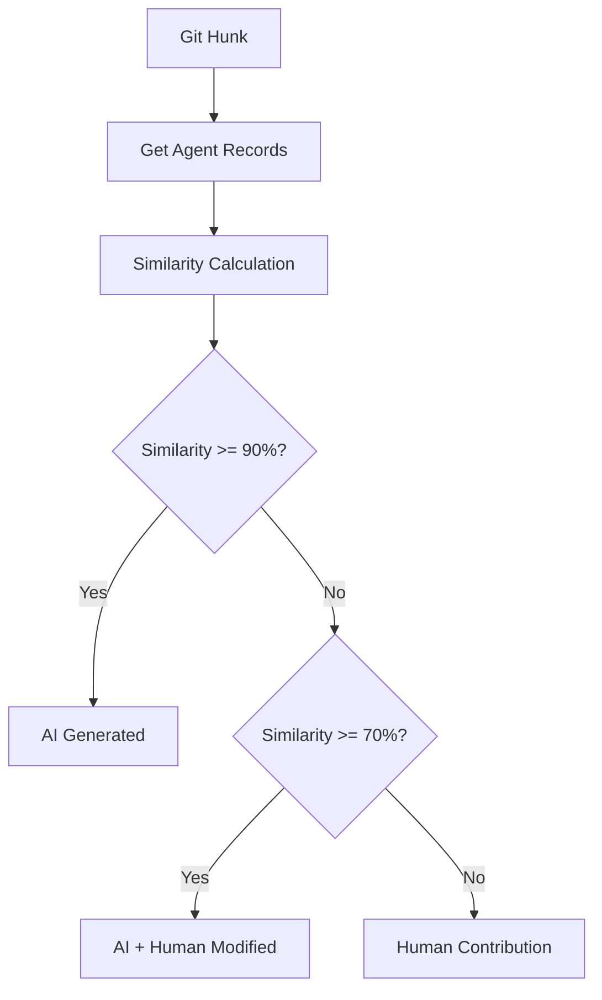
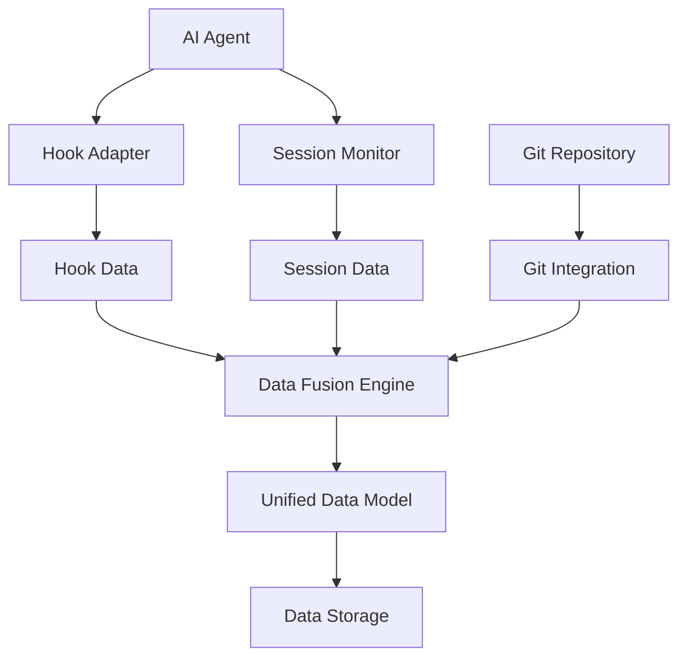

# Layer 1: Tool Layer

**Related**: [Architecture Overview](./index.md)

---

## Layer Responsibilities

Responsible for data collection, processing, and storage, providing unified data interface for upper layers.

---

## Core Components

### 1. Dual-Track Data Collection

**MVP Phase**: Hook + Session Monitoring (Passive Collection)

```
┌─────────────────────────────────────────────────────────────┐
│  Track 1: Hook Capture                                       │
│  ├─ File edits (via afterFileEdit / PostToolUse)            │
│  ├─ TODOs (Agent's task breakdown)                          │
│  └─ Session metadata                                         │
├─────────────────────────────────────────────────────────────┤
│  Track 2: Session File Monitoring                            │
│  ├─ Operation history from session files                    │
│  ├─ Conversation context                                     │
│  └─ Agent execution timeline                                │
└─────────────────────────────────────────────────────────────┘
```

**Hook Interface**:
```typescript
interface HookCore {
  onSessionStart(sessionId: string): void;
  onCodeChange(change: CodeChange): void;
  onTodoUpdate(todo: TodoItem): void;
  onSessionEnd(sessionId: string): void;
}

interface AgentAdapter {
  name: string;
  configDir: string;
  hooks: { fileEdit: string; stop: string };
  detect(): Promise<boolean>;
  connect(): Promise<void>;
}
```

> **Post-MVP: Skill Track**
> 
> Skill is designed for generating protocol content (WHAT/WHY/HOW TO VERIFY/IMPACT). 
> Will be implemented after MVP phase.

---

### 2. Data Fusion Engine

```typescript
interface DataFusion {
  merge(hookData: HookData, skillData: SkillData): ReviewData;
  resolveConflicts(conflicts: DataConflict[]): Resolution[];
  validate(data: ReviewData): ValidationResult;
}
```

**Conflict Handling Strategy**:
- Engineering metrics (timestamps, file paths, Git hash) follow Hook
- Protocol content (Intent, Rationale) follow Skill
- Other conflicts recorded first, manual handling later

---

### 3. Git Integration

```typescript
interface GitIntegration {
  getDiff(commitHash?: string): GitDiff[];
  getFileHistory(filePath: string): FileHistory[];
  getBranchInfo(): BranchInfo;
  getBlame(filePath: string): BlameInfo[];
}
```

**Technology Selection**: simple-git
- Provides structured Git data
- Good cross-platform compatibility
- Simple and easy-to-use API

---

### 4. Contributor Detection Module

Based on Hunk-level similarity matching to determine code contributor (AI generated vs human written).

**Configuration**:
```typescript
export const SIMILARITY_CONFIG = {
  THRESHOLD_PURE_AI: 0.90,        // >= 90% determined as pure AI generation
  THRESHOLD_AI_MODIFIED: 0.70,    // 70-90% determined as AI generation but human modified
  MATCHING_GRANULARITY: 'hunk' as const,
  ALGORITHM: 'levenshtein' as const,
};
```

**Detection Interface**:
```typescript
interface ContributorDetector {
  detect(hunk: GitHunk, agentRecords: AgentRecord[]): ContributorResult;
  batchDetect(hunks: GitHunk[], agentRecords: AgentRecord[]): ContributorResult[];
}

interface ContributorResult {
  hunkId: string;
  contributor: 'ai' | 'ai_modified' | 'human';
  similarity: number;
  matchedRecord?: AgentRecord;
  confidence: number;
}
```

**Detection Flow**:


---

## Data Flow Design



---

## Related Documents

- [Data Layer](./02-layer-data.md)
- [ADR-002: Data Acquisition Strategy](../adr/ADR-002-data-acquisition.md)
- [ADR-006: Contributor Detection](../adr/ADR-006-contributor-detection.md)
