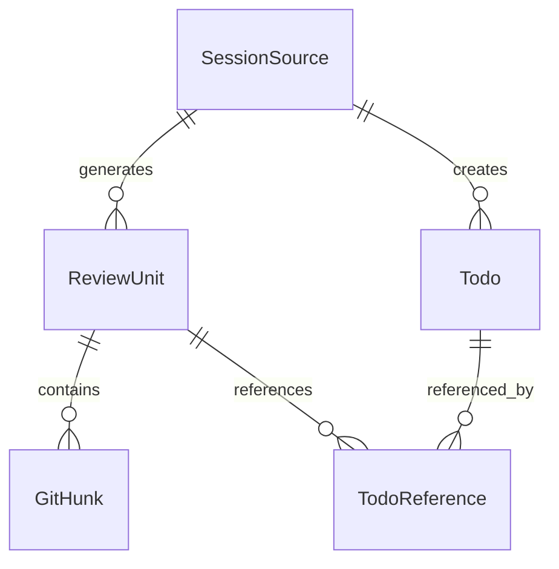

# Layer 2: Data Layer

**Related**: [Architecture Overview](./index.md)

---

## Layer Responsibilities

Define unified data models, manage data storage and queries.

---

## Core Data Models

### 1. SessionSource

```typescript
interface SessionSource {
  agent: 'cursor' | 'cursor-cli' | 'claude-code' | 'opencode' | 'gemini-cli' | string;
  sessionId: string;
  qaIndex: number;  // Which round of QA conversation
  timestamp: number;
  metadata?: {
    userPrompt?: string;
    agentResponse?: string;
    context?: any;
  };
}
```

### 2. ReviewUnit

```typescript
interface ReviewUnit {
  id: string;
  sessionSource: SessionSource;
  hunks: GitHunk[];  // May contain multiple code blocks
  annotation: {
    // Agent Review Protocol v0.3 fields
    intent: string;
    changes: string[];
    rationale: string;
    tests: string[];
    edgeCases: string[];
    // Optional fields
    impact?: string;
    alternatives?: string[];
    assumptions?: string[];
    confidence?: number;
  };
  todos: TodoReference[];
  createdAt: number;
  updatedAt: number;
}
```

### 3. Todo

```typescript
interface Todo {
  id: string;
  content: string;
  status: 'pending' | 'in_progress' | 'completed';
  priority: 'low' | 'medium' | 'high';
  sessionSource: SessionSource;  // Source tracing
  reviewUnits: string[];  // Associated ReviewUnit IDs
  createdAt: number;
  updatedAt: number;
  dueDate?: number;
  assignee?: string;
}
```

---

## Storage Design

### Storage Structure

```
.agent-blame/
├── data/
│   ├── sessions/
│   │   ├── 2026-01-04/
│   │   │   ├── session-001.json
│   │   │   └── session-002.json
│   │   └── index.json
│   ├── review-units/
│   │   ├── unit-001.json
│   │   └── unit-002.json
│   ├── todos.json
│   └── metadata.json
└── config/
    ├── settings.json
    └── adapters.json
```

### Data Relationships



---

## Related Documents

- [Tool Layer](./01-layer-tool.md)
- [Product Core Layer](./03-layer-product-core.md)
