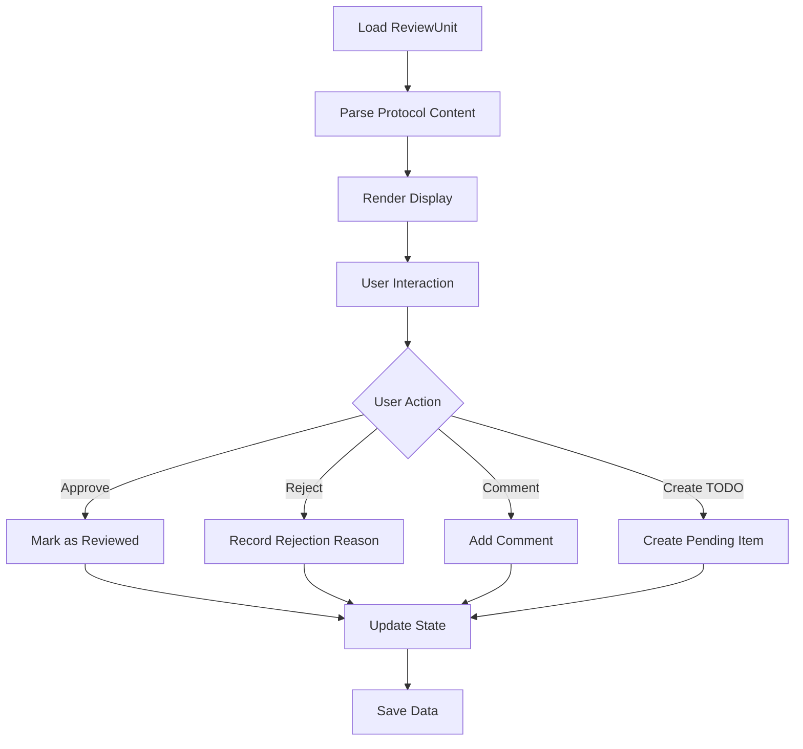

# Layer 3: Product Core Layer

**Related**: [Architecture Overview](./index.md)

---

## Layer Responsibilities

Provide core logic of product features, including protocol parsing, content rendering, interaction handling, etc.

---

## Core Components

### 1. Protocol Parser

```typescript
interface ProtocolParser {
  parse(rawContent: string): AgentProtocol;
  validate(protocol: AgentProtocol): ValidationResult;
  normalize(protocol: AgentProtocol): NormalizedProtocol;
}

interface AgentProtocol {
  what: {
    intent: string;
    changes: string[];
  };
  why: {
    rationale: string;
  };
  howToVerify: {
    tests: string[];
    edgeCases: string[];
  };
  impact?: {
    affectedAreas: string[];
    risks: string[];
  };
}
```

### 2. Rendering Engine

```typescript
interface RenderEngine {
  renderReviewUnit(unit: ReviewUnit): RenderedContent;
  renderTodoList(todos: Todo[]): RenderedContent;
  renderDiff(hunks: GitHunk[], annotation: Annotation): RenderedContent;
}

interface RenderedContent {
  html?: string;
  markdown?: string;
  terminal?: string;
  metadata: RenderMetadata;
}
```

### 3. Interaction Logic

```typescript
interface InteractionHandler {
  handleReviewAction(action: ReviewAction): Promise<ActionResult>;
  handleTodoAction(action: TodoAction): Promise<ActionResult>;
  handleNavigationAction(action: NavigationAction): Promise<ActionResult>;
}

type ReviewAction = 
  | { type: 'approve'; unitId: string }
  | { type: 'reject'; unitId: string; reason: string }
  | { type: 'comment'; unitId: string; comment: string };

type TodoAction =
  | { type: 'create'; content: string; unitId: string }
  | { type: 'update'; todoId: string; updates: Partial<Todo> }
  | { type: 'complete'; todoId: string };
```

### 4. State Management

```typescript
interface StateManager {
  getCurrentSession(): SessionState;
  getReviewProgress(): ReviewProgress;
  updateState(updates: StateUpdate): void;
  subscribeToChanges(callback: StateChangeCallback): Unsubscribe;
}

interface SessionState {
  currentReviewUnits: ReviewUnit[];
  activeTodos: Todo[];
  reviewProgress: ReviewProgress;
  userPreferences: UserPreferences;
}
```

---

## Core Processes

### Review Workflow



---

## Related Documents

- [Data Layer](./02-layer-data.md)
- [Product Delivery Layer](./04-layer-delivery.md)
