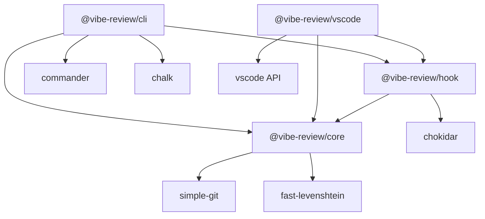

# Architecture Design

**Document Version**: v1.0  
**Created Date**: 2026-01-04  
**Last Updated**: 2026-01-27

---

## Overview

Vibe Review adopts **4-layer architecture design**, forming a complete technology stack from bottom-level tools to top-level products:

```
┌─────────────────────────────────────────────────────────────┐
│  Layer 4: Product Delivery                                    │
│  ├─ GitLens Integration | Standalone Panel | IDE Plugin | CLI    │
├─────────────────────────────────────────────────────────────┤
│  Layer 3: Product Core                                       │
│  ├─ Protocol Parser | Rendering Engine | Interaction Logic | State Mgmt │
├─────────────────────────────────────────────────────────────┤
│  Layer 2: Data Layer                                        │
│  ├─ SessionSource | ReviewUnit | Todo                        │
├─────────────────────────────────────────────────────────────┤
│  Layer 1: Tool Layer                                        │
│  ├─ Hook + Session Monitoring | Git Integration | Data Fusion│
└─────────────────────────────────────────────────────────────┘
```

---

## Architecture Principles

1. **Layered Decoupling**: Clear responsibilities per layer, upper layers depend on lower layers, lower layers do not depend on upper layers
2. **Data-Driven**: Data model at the core, all layers designed around data
3. **Open Standards**: Adopt open protocols, support ecosystem extension
4. **Progressive**: Support progressive development and deployment of features

---

## Package Structure

The project uses **Monorepo** architecture:

```
vibe-review/
├── packages/
│   ├── core/           # Core library (data models, protocols)
│   ├── hook/           # Hook system (adapters, event capture)
│   ├── cli/            # Command line tool
│   ├── vscode/         # VS Code plugin
│   └── web/            # Web interface (Post-MVP)
├── docs/               # Technical documentation
└── .vibe-review/       # Local data directory
```

**Package Dependency Graph**:



---

## Architecture Documents

| Layer | Document | Description |
|-------|----------|-------------|
| Layer 1 | [Tool Layer](./01-layer-tool.md) | Data collection, Git integration, Contributor detection |
| Layer 2 | [Data Layer](./02-layer-data.md) | Data models, Storage design |
| Layer 3 | [Product Core](./03-layer-product-core.md) | Protocol parsing, Rendering, State management |
| Layer 4 | [Product Delivery](./04-layer-delivery.md) | CLI, VS Code plugin, Interaction design |
| - | [Core Mechanisms](./05-core-mechanisms.md) | Protocol v0.3, Data collection, Data fusion |
| - | [Non-Functional Requirements](./06-nfr.md) | Technology stack, Performance, Security, Extensibility |

---

## Related Documents

- [ADR Index](../adr/index.md) - Architecture Decision Records
- [Requirements Analysis](../01-requirements.md)
- [Task List](../04-task-list.md)
